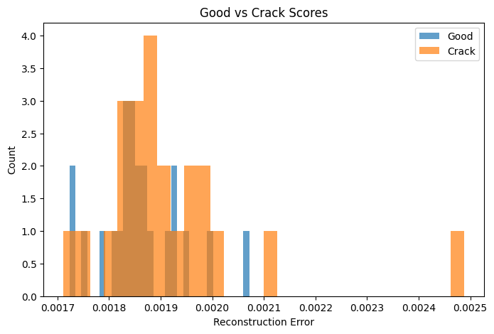
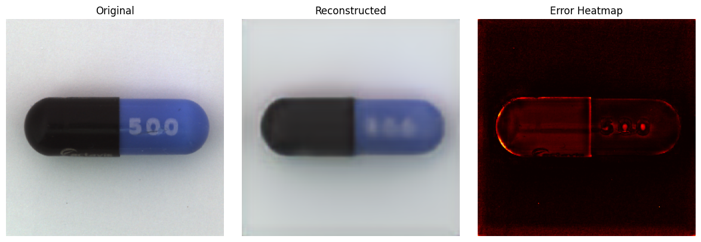

# Capsule Defect Detection using Autoencoders

## 🔍 Overview
This project demonstrates unsupervised anomaly detection in capsule images using a convolutional autoencoder.

The model is trained only on normal capsules and detects defects using reconstruction error.

---

## ⚠️ Challenge
The initial model failed to separate normal and defective images effectively:
- Similar reconstruction errors
- Weak anomaly detection

---

## ✅ Improvements
- Increased image resolution (128x128)
- Deeper CNN architecture
- More training epochs

These improvements led to better defect detection.

---

## 📊 Results
| Category | Mean Score | Anomaly Rate |
|----------|-----------|-------------|
| Good     | 0.001858  | 4.35%       |
| Crack    | 0.001916  | 8.70%       |

Defective samples show higher anomaly scores.

---

## 🔥 Visual Results

### Histogram

### Heatmap

Heatmaps highlight defect regions and structural differences.

---

## 🧠 Method
1. Train autoencoder on normal images  
2. Reconstruct test images  
3. Compute reconstruction error  
4. Apply threshold for anomaly detection  

---

## 🛠️ Tech Stack
- Python
- TensorFlow / Keras
- NumPy
- Matplotlib

---

## 🚀 Future Work
- Improve model separation
- Test more defect types
- Deploy real-time inspection system

---

## 💡 Key Insight
This project shows how anomaly detection can work without labeled data, using reconstruction error and visual analysis.
