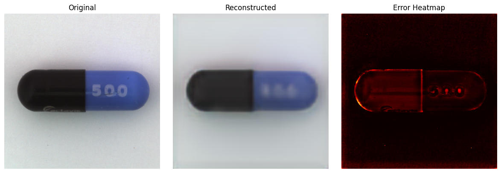
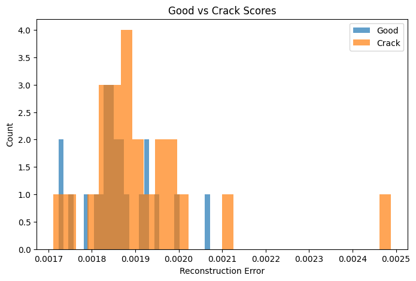

# 🧠 Capsule Anomaly Detection using Autoencoders

Detecting anomalies in medical capsule images using unsupervised deep learning.

---

## 🚀 Problem
Medical capsule imaging generates large volumes of data, making it difficult to manually identify abnormal patterns.

---

## 💡 Solution
Built a convolutional autoencoder to detect anomalies by learning normal image patterns and identifying deviations.

---

## ⚙️ Approach
- Unsupervised Learning
- Convolutional Autoencoder
- Reconstruction error used as anomaly score

---

## 📊 Results
- Model successfully distinguishes normal vs abnormal patterns
- Visualization using heatmaps and histograms

---

## 📸 Visual Results

### 🔥 Heatmap


### 📈 Histogram


---

## 🛠 Tech Stack
Python • TensorFlow/PyTorch • OpenCV • NumPy • Matplotlib  

---

## ▶️ How to Run

```bash
git clone https://github.com/SiyaNhl/capsule-anomaly-detection
cd capsule-anomaly-detection
pip install -r requirements.txt
